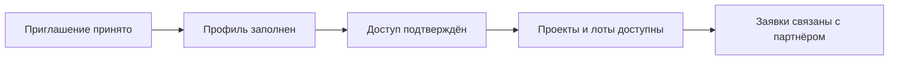

Кабинет партнёра застройщика открывается, когда девелопер приглашает внешнего участника продаж в свою агентскую сеть.

Партнёром застройщика может быть агентство недвижимости, частный брокер, агент или другой участник, который работает с проектами конкретного девелопера.

<Info>
  Этот кабинет относится к агентской сети девелопера. Он не является партнёрской программой GRIDIX.
</Info>

## Что можно делать

<CardGroup cols={2}>
  <Card title="Смотреть проекты" icon="building">
    Открывать проекты, к которым девелопер дал доступ.
  </Card>
  <Card title="Проверять лоты" icon="table">
    Смотреть актуальные цены, статусы, планировки и характеристики.
  </Card>
  <Card title="Передавать заявки" icon="inbox">
    Отправлять заявки девелоперу в рамках доступного сценария.
  </Card>
  <Card title="Работать с материалами" icon="file-text">
    Использовать разрешённые материалы проекта в коммуникации с клиентом.
  </Card>
</CardGroup>

## Как начать работу

<Steps>
  <Step title="Получите приглашение">
    Девелопер отправляет приглашение в агентскую сеть.
  </Step>
  <Step title="Примите доступ">
    Откройте ссылку приглашения. Если аккаунт GRIDIX уже есть, используйте существующий аккаунт.
  </Step>
  <Step title="Заполните профиль">
    Укажите контактные данные, формат работы и документы, если они требуются.
  </Step>
  <Step title="Дождитесь подтверждения">
    Девелопер проверяет профиль и активирует доступ.
  </Step>
  <Step title="Откройте проекты">
    Перейдите к доступным проектам, проверьте лоты и начните работу с клиентами.
  </Step>
</Steps>

## Что видит партнёр

<Warning>
  Не путайте этот кабинет с партнёрской программой GRIDIX. Здесь партнёр работает с объектами конкретного девелопера. Партнёрская программа GRIDIX нужна для рекомендации самой платформы GRIDIX новым клиентам.
</Warning>

## Частые ситуации

<AccordionGroup>
  <Accordion title="У партнёра уже есть аккаунт GRIDIX">
    Новый кабинет создавать не нужно. Доступ к проектам девелопера добавляется к существующему аккаунту после принятия приглашения.
  </Accordion>
  <Accordion title="Проект не отображается">
    Проверьте, подтверждён ли доступ и открыт ли партнёру именно этот проект.
  </Accordion>
  <Accordion title="Не видно лотов или материалов">
    Девелопер мог ограничить доступ к части проектов, лотов или файлов. Нужно проверить настройки доступа.
  </Accordion>
</AccordionGroup>

<Frame>
  Сюда скриншот: главный экран кабинета партнёра застройщика, доступные проекты, список лотов, материалы проекта, список заявок.
</Frame>

<Frame>
  Сюда видео: 90-секундный обзор кабинета — от приглашения до отправки заявки клиенту.
</Frame>

## Что дальше

<CardGroup cols={3}>
  <Card title="Принять приглашение" icon="user-tie" href="/ru/broker-cabinet/getting-started/accept-invitation">
    Первый вход и привязка доступа.
  </Card>
  <Card title="Что видит партнёр" icon="building" href="/ru/broker-cabinet/what-partner-sees">
    Проекты, лоты, материалы и заявки.
  </Card>
  <Card title="Отправить ссылку клиенту" icon="code" href="/ru/broker-cabinet/client-work/share-link">
    Как поделиться проектом или лотом.
  </Card>
</CardGroup>
