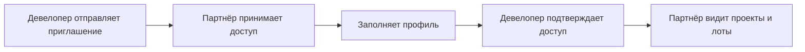

Партнёр застройщика - это внешний участник продаж: агентство недвижимости, частный брокер, агент или другой партнёр, которому девелопер открывает доступ к своим проектам.

Этот сценарий относится к агентской сети девелопера. Он не является партнёрской программой GRIDIX.

<Info>
  Агентская сеть помогает девелоперу работать с внешними продавцами недвижимости. Партнёрская программа GRIDIX помогает рекомендовать саму платформу GRIDIX новым клиентам.
</Info>

## Что подготовить

- email или контакт партнёра;
- формат участника: агентство, брокер, агент или другой партнёр застройщика;
- список проектов, к которым нужно открыть доступ;
- правила работы с заявками;
- условия комиссии, если они уже согласованы;
- материалы, которые партнёр может использовать в работе с клиентами.

## Как пригласить

<Steps>
  <Step title="Откройте агентскую сеть">
    В кабинете девелопера перейдите в раздел агентской сети.
  </Step>
  <Step title="Создайте приглашение">
    Укажите контакт партнёра и формат работы.
  </Step>
  <Step title="Выберите доступные проекты">
    Откройте все проекты или только те, с которыми партнёр должен работать.
  </Step>
  <Step title="Отправьте приглашение">
    Партнёр получает ссылку или сообщение для принятия доступа.
  </Step>
  <Step title="Проверьте профиль">
    После заполнения данных проверьте участника и активируйте доступ, если это требуется.
  </Step>
</Steps>

## Что происходит после приглашения

## Частые вопросы

<AccordionGroup>
  <Accordion title="Если партнёр уже зарегистрирован в GRIDIX">
    Новый аккаунт создавать не нужно. Доступ к проектам девелопера добавляется к существующему аккаунту, если приглашение принято под правильным пользователем.
  </Accordion>
  <Accordion title="Если партнёр не видит проект">
    Проверьте, принято ли приглашение, активирован ли профиль и открыт ли доступ именно к этому проекту.
  </Accordion>
  <Accordion title="Если нужно отключить доступ">
    Измените статус участника или уберите доступ к конкретному проекту в настройках агентской сети.
  </Accordion>
</AccordionGroup>

<Frame>
  Сюда скриншот: кнопка приглашения, форма приглашения, выбор проектов, статус приглашения, профиль партнёра после принятия доступа.
</Frame>

<Frame>
  Сюда видео: как пригласить агентство и открыть доступ к проектам.
</Frame>

## Что дальше

- [Агентская сеть девелопера](/ru/broker-network/overview)
- [Что видит партнёр после приглашения](/ru/broker-cabinet/what-partner-sees)
- [Заявки от партнёров](/ru/broker-network/leads)
