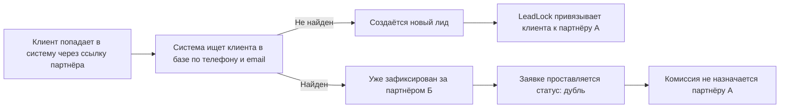

LeadLock — это механизм, который привязывает клиента к одному партнёру на согласованный срок. Пока срок не истёк, никакой другой партнёр в сети не может «забрать» этого клиента себе. Так в продажах не возникает ситуации, когда два агентства приводят одного и того же человека и начинают спорить за комиссию.

LeadLock работает автоматически. Девелопер настраивает только две вещи: срок фиксации и форс-мажор. Дальше система сама проверяет дубли и закрепляет клиента за нужным партнёром.

## Как это устроено

## Срок фиксации

Срок задаётся в [Условиях программы](/ru/broker-network/program-settings). Обычно — от 30 до 90 дней. Что происходит:

- партнёр А привёл клиента в день X;
- срок начал отсчёт от дня X;
- если клиент покупает квартиру до дня X+30 — комиссия идёт партнёру А;
- если на дне X+30 сделки нет — фиксация снимается, и другой партнёр может зафиксировать этого же клиента.

## Форс-мажор

Иногда сделка не закрывается по объективной причине: клиент уехал, банк затянул ипотеку, нужны дополнительные документы. На такие случаи в условиях программы есть параметр **Форс-мажор, недели**.

Если за время срока фиксации сделка не вышла на финиш по форс-мажорной причине, фиксацию можно продлить на это количество недель. Решение принимает девелопер: открывает заявку и продлевает срок вручную.

## Что видит партнёр при дубле

Если партнёр приводит клиента, а тот уже зафиксирован за другим партнёром, в кабинете партнёра появится статус заявки **Дубль**. Что важно:

- партнёр видит факт дубля;
- партнёр не получает комиссию за такую заявку;
- остальные данные о клиенте (за кем зафиксирован, его контакты, история) не показываются — это правило конфиденциальности между партнёрами.

{/* SCREENSHOT: карточка заявки в кабинете партнёра, статус «Дубль», без раскрытия данных.
    Файл: /images/broker-network/leadlock-duplicate.png */}

## Что видит девелопер

Девелопер видит и саму заявку, и информацию о фиксации:

- кто из партнёров зафиксировал клиента первым;
- когда истекает срок фиксации;
- сколько раз другой партнёр пытался зафиксировать того же клиента.

Это помогает понять, кто из партнёров реально работает по своей базе, а кто пытается «переписать» чужих клиентов.

## По каким полям сравниваются клиенты

GRIDIX считает клиентов одинаковыми, если совпадает телефон или email. Имя в сравнении не участвует — слишком много совпадений и опечаток.

Если у клиента несколько телефонов и партнёры приводят его по разным — система может не поймать дубль автоматически. В этом случае девелопер может объединить заявки руками: открывает каждую и через действие **Объединить дубли** связывает их в одного клиента.

## Срок фиксации = 0

Если в условиях программы срок фиксации задан как `0`, фиксация бессрочная. Клиент остаётся за партнёром, пока девелопер сам не снимет привязку. Этот режим используют в премиум-сетях, где партнёров мало и работа на эксклюзивных территориях.

## Как продлить фиксацию

<Steps>
  <Step title="Откройте карточку лида">
    В CRM найдите заявку этого клиента.
  </Step>
  <Step title="Найдите блок «Фиксация»">
    В нём указан партнёр, дата истечения и причина (если фиксация уже продлевалась).
  </Step>
  <Step title="Нажмите «Продлить»">
    Введите количество недель (не больше форс-мажорного лимита) и причину. Партнёр получит уведомление, что его фиксация продлена.
  </Step>
</Steps>

## Если что-то не так

<AccordionGroup>
  <Accordion title="Партнёр уверен, что клиент был его — но система записала дубль">
    Откройте карточку лида и посмотрите, по какому полю сработал дубль (телефон или email) и кто зафиксировал клиента первым. Если это ошибка — снимите фиксацию или объедините заявки вручную.
  </Accordion>
  <Accordion title="Срок фиксации истёк, но партнёр настаивает на продлении">
    Партнёр должен предоставить причину форс-мажора. Девелопер сам решает, продлевать или нет. Если причина не подходит — фиксация снимается, клиент становится «свободным».
  </Accordion>
  <Accordion title="Клиент пришёл напрямую, минуя партнёра">
    Если клиент уже зафиксирован за партнёром, а заявка прилетела с обычной формы сайта (без партнёрской ссылки) — комиссия всё равно идёт партнёру. Фиксация работает по клиенту, а не по точке входа.
  </Accordion>
</AccordionGroup>

<Tip>
  Чтобы не было конфликтов с партнёрами, обсуждайте срок фиксации заранее и зафиксируйте его в
  оферте. 30 дней — стандартное значение, оно работает для большинства проектов.
</Tip>

## Что дальше

<CardGroup cols={2}>
  <Card title="Условия программы" icon="file-contract" href="/ru/broker-network/program-settings">
    Где задаётся срок фиксации и форс-мажор.
  </Card>
  <Card title="Дубли клиентов" icon="copy" href="/ru/broker-cabinet/client-work/duplicate-client">
    Что делает партнёр, если клиент оказался дублем.
  </Card>
</CardGroup>
