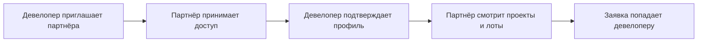

Агентская сеть девелопера - это раздел, где девелопер подключает внешних продавцов недвижимости к своим проектам.

В сеть могут входить партнёры застройщика, агентства недвижимости, частные брокеры и агенты. Они получают доступ к актуальным проектам, лотам, ценам, статусам и материалам, а девелопер видит заявки и источники обращений.

<Info>
  Агентская сеть девелопера и партнёрская программа GRIDIX - разные сценарии. Агентская сеть помогает продавать объекты конкретного девелопера. Партнёрская программа GRIDIX помогает рекомендовать саму платформу GRIDIX новым клиентам.
</Info>

## Для чего нужна

<CardGroup cols={2}>
  <Card title="Открыть доступ к проектам" icon="building">
    Дать партнёрам застройщика доступ к актуальным проектам и лотам.
  </Card>
  <Card title="Контролировать источники" icon="inbox">
    Видеть заявки, которые пришли от внешних участников продаж.
  </Card>
  <Card title="Управлять участниками" icon="users">
    Приглашать, подтверждать, отключать и проверять статусы участников.
  </Card>
  <Card title="Работать с комиссиями" icon="handshake">
    Смотреть начисления и выплаты, если этот сценарий используется в вашей конфигурации.
  </Card>
</CardGroup>

## Кто участвует

| Участник | Роль |
| --- | --- |
| Девелопер | Создаёт проекты, задаёт условия, принимает заявки и управляет доступом |
| Партнёр застройщика | Работает с проектами девелопера в рамках выданного доступа |
| Агентство недвижимости | Подключает команду или работает как внешний продавец |
| Брокер / агент | Смотрит лоты, отправляет ссылки клиентам и передаёт заявки |
| Менеджер девелопера | Обрабатывает заявки и контролирует сделку |

## Рабочий процесс

<Steps>
  <Step title="Пригласите партнёра застройщика">
    Создайте приглашение для агентства, брокера, агента или другого партнёра.
  </Step>
  <Step title="Откройте проекты">
    Выберите, какие проекты и материалы будут доступны участнику.
  </Step>
  <Step title="Проверьте профиль">
    Убедитесь, что партнёр заполнил необходимые данные.
  </Step>
  <Step title="Проверьте первую заявку">
    Отправьте тестовую заявку или проверьте реальную, чтобы увидеть источник и связь с партнёром.
  </Step>
</Steps>

{/* SCREENSHOT: раздел агентской сети, список участников, форма приглашения, выбор доступных проектов, заявка от партнёра застройщика */}
<Frame caption="раздел агентской сети, список участников, форма приглашения, выбор доступных проектов, заявка от партнёра застройщика">
  
</Frame>

{/* VIDEO: запуск агентской сети — от приглашения до первой заявки */}
<Frame caption="запуск агентской сети — от приглашения до первой заявки">
  
</Frame>

## Что дальше

<CardGroup cols={3}>
  <Card title="Пригласить партнёра" icon="users" href="/ru/broker-network/invite-partner">
    Создайте приглашение и откройте доступ к проектам.
  </Card>
  <Card title="Участники сети" icon="users" href="/ru/broker-network/agencies">
    Управляйте агентствами, брокерами и партнёрами.
  </Card>
  <Card title="Заявки от партнёров" icon="inbox" href="/ru/broker-network/leads">
    Проверяйте источники и обработку заявок.
  </Card>
</CardGroup>
