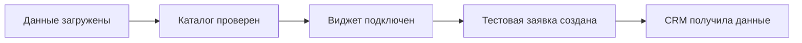

Этот чек-лист помогает интегратору подготовить клиента к запуску GRIDIX: собрать данные, настроить проект, проверить каталог, подключить сайт и протестировать заявки.

## Материалы от клиента

<CardGroup cols={2}>
  <Card title="Проект" icon="building">
    Название, описание, адрес, логотип, рендеры, языки, валюты и публичные материалы.
  </Card>
  <Card title="Лоты" icon="table">
    Excel, CSV или Google Sheets с лотами, ценами, статусами, площадями и характеристиками.
  </Card>
  <Card title="Планировки" icon="map">
    Поэтажные планы, планировки лотов, изображения объектов и генплан, если он нужен.
  </Card>
  <Card title="Подключения" icon="plug">
    Доступ к сайту или разработчику, CRM-админ, правила назначения ответственных и тестовый канал заявки.
  </Card>
</CardGroup>

## Проверка перед настройкой

<Steps>
  <Step title="Согласуйте тип проекта">
    Зафиксируйте, что запускается: здание, объекты или генплан.
  </Step>
  <Step title="Проверьте таблицу лотов">
    Убедитесь, что номера уникальны, цены числовые, статусы единые, а обязательные поля заполнены.
  </Step>
  <Step title="Проверьте материалы">
    Откройте изображения и планировки на обычном экране. Они должны быть читаемыми без сильного увеличения.
  </Step>
  <Step title="Согласуйте путь заявки">
    Определите, должна ли заявка оставаться в GRIDIX, уходить в CRM или назначаться конкретному менеджеру.
  </Step>
</Steps>

## Проверка перед публикацией

<Steps>
  <Step title="Проверьте лоты">
    Откройте несколько лотов с разными статусами, ценами и планировками.
  </Step>
  <Step title="Проверьте публичный каталог">
    Откройте ссылку без авторизации и проверьте desktop и mobile.
  </Step>
  <Step title="Проверьте виджет">
    Убедитесь, что контейнер отображается, скрипт загружается и страница не обрезает каталог.
  </Step>
  <Step title="Отправьте тестовую заявку">
    Проверьте, что заявка появилась в GRIDIX с правильным проектом, лотом и источником.
  </Step>
  <Step title="Проверьте CRM">
    Если интеграция подключена, найдите лид или сделку в CRM и сверьте поля.
  </Step>
</Steps>

## Что передать клиенту

- ссылку на проект или публичный каталог;
- страницу сайта с виджетом;
- список проверенных сценариев;
- тестовую заявку и результат в CRM;
- список оставшихся вопросов, если часть информации ещё готовится;
- ссылку на релевантные статьи базы знаний.

<Warning>
  Не обещайте клиенту неподтверждённые сроки, тарифы, интеграции или будущие функции. В Центре помощи GRIDIX описываются только реальные возможности продукта.
</Warning>

{/* SCREENSHOT: пример таблицы лотов, preview проекта, публичный каталог, виджет на сайте, тестовая заявка в GRIDIX и CRM */}
<Frame caption="пример таблицы лотов, preview проекта, публичный каталог, виджет на сайте, тестовая заявка в GRIDIX и CRM">
  
</Frame>

{/* VIDEO: 2-минутный обзор полного чек-листа от данных до тестовой заявки в CRM */}
<Frame caption="2-минутный обзор полного чек-листа от данных до тестовой заявки в CRM">
  
</Frame>

## Что дальше

- [Что подготовить перед запуском](/ru/developer-start/launch-preparation)
- [Создание проекта](/ru/projects/creation)
- [Встраивание виджета](/ru/widgets/embedding)
