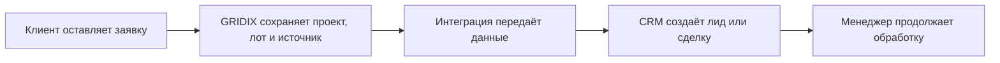

GRIDIX может использоваться как точка сбора заявок и передавать их в подключенную CRM, если интеграция настроена и доступна в вашем рабочем пространстве.

## Общая схема

## Что нужно подготовить

- доступ администратора к CRM;
- воронку и этап, куда должна попадать заявка;
- ответственного менеджера или правило назначения;
- список полей, которые нужно передавать;
- тестовый проект и тестовый лот;
- понимание, какие источники нужно различать: сайт, виджет, публичный каталог, партнёр застройщика.

## Как проверить передачу

<Steps>
  <Step title="Проверьте подключение CRM">
    Откройте настройки интеграции и убедитесь, что подключение активно.
  </Step>
  <Step title="Отправьте тестовую заявку">
    Используйте публичный каталог или виджет, чтобы проверить реальный путь клиента.
  </Step>
  <Step title="Откройте заявку в GRIDIX">
    Проверьте проект, лот, контактные данные и источник.
  </Step>
  <Step title="Откройте CRM">
    Найдите созданный лид или сделку и проверьте, что данные передались корректно.
  </Step>
  <Step title="Зафиксируйте результат">
    Если заявка не появилась в CRM, сохраните время отправки, источник и скриншоты для диагностики.
  </Step>
</Steps>

<Tabs>
  <Tab title="AmoCRM">
    Начните со статьи [AmoCRM](/ru/crm-integrations/amocrm). Проверьте авторизацию, воронку, ответственного и тестовую заявку.
  </Tab>
  <Tab title="Bitrix24">
    Начните со статьи [Bitrix24](/ru/crm-integrations/bitrix24). Проверьте подключение, поля заявки и наличие тестового лида.
  </Tab>
  <Tab title="Интегратор">
    Перед запуском составьте короткий test log: источник, время заявки, проект, лот, результат в GRIDIX, результат в CRM.
  </Tab>
</Tabs>

<Warning>
  Не подключайте CRM до проверки публичного каталога и лотов. Если в проекте неверные цены, статусы или лоты, эти ошибки могут попасть в CRM.
</Warning>

{/* SCREENSHOT: тестовая заявка в GRIDIX, созданный лид в CRM, поля источника и выбранного лота */}
<Frame caption="тестовая заявка в GRIDIX, созданный лид в CRM, поля источника и выбранного лота">
  
</Frame>

{/* VIDEO: настройка передачи заявок в CRM от и до */}
<Frame caption="настройка передачи заявок в CRM от и до">
  
</Frame>

## Что дальше

- [Источник заявки](/ru/leads/source)
- [Управление заявками](/ru/leads/management)
- [Частые ошибки Bitrix24](/ru/crm-integrations/bitrix24)
