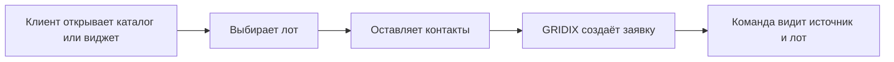

Заявка - это обращение клиента по проекту, лоту, форме, ссылке или другому каналу. В GRIDIX заявка может быть связана с конкретным лотом, источником и ответственным сотрудником.

## Как появляются заявки

<Steps>
  <Step title="Пользователь открывает проект">
    Он может прийти на публичный каталог, сайт с виджетом, собственный домен или ссылку партнёра застройщика.
  </Step>
  <Step title="Выбирает лот или форму">
    Пользователь смотрит планировку, цену, статус и параметры объекта.
  </Step>
  <Step title="Отправляет заявку">
    GRIDIX сохраняет контактные данные и контекст обращения.
  </Step>
  <Step title="Команда обрабатывает заявку">
    Заявка остаётся в GRIDIX или передаётся в подключенную CRM.
  </Step>
</Steps>

## Что содержит заявка

<CardGroup cols={2}>
  <Card title="Данные клиента" icon="user-tie">
    Имя, телефон, email, комментарий и другие поля формы.
  </Card>
  <Card title="Данные объекта" icon="building">
    Проект, лот, этаж, цена, планировка и параметры, если они доступны.
  </Card>
  <Card title="Источник" icon="code">
    Виджет, публичный каталог, сайт, домен, партнёр застройщика или ручное действие.
  </Card>
  <Card title="Обработка" icon="inbox">
    Статус, ответственный, CRM-связь и история работы.
  </Card>
</CardGroup>

## Сценарии по ролям

<Tabs>
  <Tab title="Девелопер">
    Девелопер смотрит заявки по проектам, источники обращений и эффективность каналов.
  </Tab>
  <Tab title="Менеджер продаж">
    Менеджер открывает заявку, связывается с клиентом, меняет статус и продолжает работу в GRIDIX или CRM.
  </Tab>
  <Tab title="Партнёр застройщика">
    Партнёр видит заявки, связанные с его действиями, если такой доступ открыт девелопером.
  </Tab>
  <Tab title="Интегратор">
    Интегратор проверяет тестовую заявку, источник, связь с лотом и передачу в CRM.
  </Tab>
</Tabs>

## Как проверить путь заявки

<Steps>
  <Step title="Откройте реальный источник">
    Используйте публичный каталог, виджет на сайте или тестовую ссылку.
  </Step>
  <Step title="Выберите лот">
    Откройте карточку лота, чтобы заявка сохранила связь с объектом интереса.
  </Step>
  <Step title="Отправьте тестовую заявку">
    Используйте тестовые контактные данные.
  </Step>
  <Step title="Проверьте GRIDIX">
    Убедитесь, что проект, лот, источник и контактные данные отображаются корректно.
  </Step>
  <Step title="Проверьте CRM">
    Если интеграция подключена, найдите лид или сделку во внешней системе.
  </Step>
</Steps>

{/* SCREENSHOT: форма заявки, список заявок, карточка заявки, источник, связанный лот и тестовый лид в CRM */}

{/* VIDEO: путь заявки от формы до карточки и CRM */}

## Что дальше

<CardGroup cols={3}>
  <Card title="Что такое заявка" icon="inbox" href="/ru/leads/what-is-lead">
    Базовое объяснение заявки и её данных.
  </Card>
  <Card title="Источник заявки" icon="code" href="/ru/leads/source">
    Как понимать канал обращения.
  </Card>
  <Card title="Заявка в CRM" icon="plug" href="/ru/leads/crm-flow">
    Как проверить передачу заявки.
  </Card>
</CardGroup>
