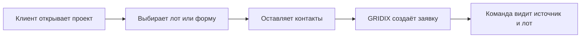

Заявка в GRIDIX - это конкретное обращение клиента по проекту, лоту, форме, ссылке, виджету или другому каналу.

Контакт отвечает на вопрос “кто это?”. Заявка отвечает на вопрос “по какому проекту, лоту или предложению человек обратился сейчас?”.

## Для кого это важно

<Tabs>
  <Tab title="Девелопер">
    Девелопер видит заявки по своим проектам, источники обращений и связь с лотами.
  </Tab>
  <Tab title="Менеджер продаж">
    Менеджер обрабатывает заявку, связывается с клиентом и меняет статус работы.
  </Tab>
  <Tab title="Партнёр застройщика">
    Партнёр видит заявки, которые связаны с его действиями, ссылками или переданными клиентами в рамках доступного функционала.
  </Tab>
  <Tab title="Интегратор">
    Интегратор проверяет, что заявка создаётся, содержит источник и при необходимости передаётся в CRM.
  </Tab>
</Tabs>

## Что содержит заявка

<CardGroup cols={2}>
  <Card title="Данные клиента" icon="user">
    Имя, телефон, email, комментарий и другие поля формы.
  </Card>
  <Card title="Данные интереса" icon="building">
    Проект, лот, планировка, цена, статус и параметры объекта, если они доступны.
  </Card>
  <Card title="Источник" icon="link">
    Виджет, публичный каталог, сайт, домен, партнёр застройщика или ручное действие.
  </Card>
  <Card title="Обработка" icon="inbox">
    Статус, ответственный, CRM-связь и дальнейшие действия команды.
  </Card>
</CardGroup>

## Как появляется заявка

## Что проверить

<Steps>
  <Step title="Откройте источник заявки">
    Используйте публичный каталог, виджет или ссылку партнёра застройщика.
  </Step>
  <Step title="Выберите проект и лот">
    Если сценарий связан с лотом, откройте конкретную карточку перед отправкой формы.
  </Step>
  <Step title="Отправьте тестовую заявку">
    Используйте тестовое имя и телефон, чтобы не смешивать проверку с реальными клиентами.
  </Step>
  <Step title="Проверьте карточку заявки">
    Убедитесь, что видны контакт, проект, лот, источник и статус обработки.
  </Step>
</Steps>

<Check>
  Хорошая заявка помогает менеджеру понять не только кто обратился, но и откуда пришёл клиент, какой объект его интересует и что делать дальше.
</Check>

## Что дальше

- [Как заявки попадают в CRM](/ru/leads/crm-flow)
- [Источник заявки](/ru/leads/source)
- [Контакт и заявка](/ru/contacts/contact-vs-lead)
