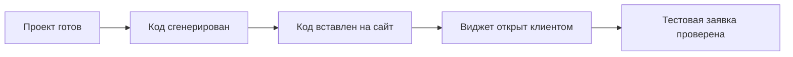

<Frame>
  
</Frame>

{/* VIDEO: пошаговая встройка виджета на сайт за 90 секунд */}
<Frame caption="пошаговая встройка виджета на сайт за 90 секунд">
  
</Frame>

Виджет GRIDIX позволяет встроить смарт-каталог, интерактивную шахматку, планировки и формы заявок на сайт девелопера или агентства. Посетитель остаётся на вашем сайте, выбирает лот на визуальном плане и отправляет заявку без перехода в отдельный кабинет.

Обычно установка занимает несколько шагов: выбрать проект в кабинете GRIDIX, сгенерировать embed-код, вставить его в сайт и проверить работу на десктопе и мобильных устройствах.



<Note>
  **Видео:** пример работы с проектом GRIDIX. Если у вас есть отдельный ролик про генерацию виджета, лучше использовать его здесь.
</Note>

<iframe src="https://www.youtube.com/embed/nIbp3pd9Mio" title="Пример работы с проектом GRIDIX" frameborder="0" className="w-full aspect-video rounded-xl" allow="accelerometer; autoplay; clipboard-write; encrypted-media; gyroscope; picture-in-picture; web-share" allowFullScreen />

## Самый простой путь

Если вы настраиваете виджет без разработчика, двигайтесь по этому короткому сценарию.

<Steps>
  <Step title="Сгенерируйте код в GRIDIX">
    Откройте раздел виджетов, выберите проект и язык интерфейса.
  </Step>
  <Step title="Вставьте код на сайт">
    Используйте HTML-блок в CMS или передайте код человеку, который отвечает за сайт.
  </Step>
  <Step title="Проверьте заявку">
    Откройте опубликованную страницу как обычный посетитель и отправьте тестовую заявку.
  </Step>
</Steps>

## Что делает виджет

Виджет переносит ключевые возможности GRIDIX на внешний сайт:

- **Интерактивные планировки**: пользователь может выбирать лоты прямо на плане.
- **Сбор заявок**: формы обращения встроены в пользовательский сценарий.
- **Несколько языков**: интерфейс можно открыть на русском или английском.
- **Адаптивная верстка**: виджет работает на разных размерах экрана.
- **Брендирование**: контейнер и окружение можно настроить под стиль сайта.

## Когда использовать виджет

<CardGroup cols={2}>
  <Card title="Сайт девелопера" icon="building">
    Покажите один проект с шахматкой, планировками и формой заявки прямо на странице жилого комплекса.
  </Card>
  <Card title="Сайт агентства" icon="layout-grid">
    Разместите подборку проектов или отдельный проект без перехода пользователя в другой интерфейс.
  </Card>
  <Card title="Лендинг проекта" icon="panel-top">
    Добавьте интерактивный блок после описания проекта, чтобы пользователь сразу перешёл к выбору лота.
  </Card>
  <Card title="Внутренняя витрина" icon="monitor">
    Используйте виджет на закрытой странице для менеджеров, партнёров или презентаций отдела продаж.
  </Card>
</CardGroup>

## Перед началом

Перед установкой проверьте, что:

- проект опубликован и содержит актуальные планировки;
- в проекте настроены лоты, цены и статусы доступности;
- формы заявок включены и ведут лиды в нужный раздел GRIDIX;
- у вас есть доступ к HTML-коду сайта, CMS-блоку или разработчику сайта.

## Как получить embed-код

### Шаг 1. Откройте генератор виджета

<Steps>
  <Step title="Перейдите в раздел виджетов">
    В административном кабинете GRIDIX откройте раздел виджетов.
  </Step>
  <Step title="Выберите проект">
    Укажите, что нужно показать на сайте:

    - один конкретный проект;
    - все проекты девелопера.
  </Step>
  <Step title="Выберите язык">
    Задайте язык интерфейса по умолчанию:

    - русский (`ru`);
    - английский (`en`).
  </Step>
</Steps>

### Шаг 2. Скопируйте код

<Steps>
  <Step title="Проверьте настройки">
    Убедитесь, что выбран правильный проект и нужный язык.
  </Step>
  <Step title="Скопируйте embed-код">
    Нажмите кнопку копирования кода, чтобы получить готовый embed-фрагмент.
  </Step>
  <Step title="Вставьте код на сайт">
    Добавьте код в HTML-страницу, CMS-блок или шаблон сайта.
  </Step>
</Steps>

## Базовый пример кода

```html
<div id="gridix-widget-root"></div>
<script src="https://your-gridix-domain.com/widget/index.js"></script>
<script>
  document.addEventListener('DOMContentLoaded', function() {
    window.GridixWidget && window.GridixWidget.init({
      lang: "ru",
      projectId: "your-project-id"
    });
  });
</script>
```

В этом коде есть три основные части:

- **Контейнер**: `<div id="gridix-widget-root"></div>` определяет место, где появится виджет.
- **Скрипт**: подключает библиотеку виджета GRIDIX.
- **Инициализация**: передает настройки проекта и языка.

## Где взять `projectId` и `userId`

- `projectId` используется, когда на странице нужно показать один конкретный проект.
- `userId` используется, когда нужно показать все проекты девелопера или агентства.
- Эти значения берутся из кабинета GRIDIX или из готового embed-кода, который сгенерирован в разделе виджетов.

<Tip>
  В реальном коде замените `your-gridix-domain.com`, `your-project-id` или `your-user-id` на значения из кабинета GRIDIX.
</Tip>

## Встраивание на сайт

<Tabs>
  <Tab title="Самостоятельно" icon="user">
    <Badge color="green" size="sm">Просто</Badge>

    Подходит, если в вашей CMS есть блок для вставки HTML-кода.

    <Steps>
      <Step title="Откройте страницу в CMS">
        Перейдите к странице, где должен появиться виджет: страница проекта, лендинг или раздел с планировками.
      </Step>
      <Step title="Добавьте HTML-блок">
        Найдите блок с названием "HTML", "Custom HTML", "Embed", "Code" или похожим.
      </Step>
      <Step title="Вставьте embed-код">
        Вставьте код из кабинета GRIDIX, сохраните страницу и откройте предпросмотр.
      </Step>
    </Steps>
  </Tab>
  <Tab title="HTML" icon="code">
    <Badge color="blue" size="sm">Для разработчика</Badge>

    <Steps>
      <Step title="Откройте HTML-файл">
        Найдите страницу или шаблон, где должен отображаться виджет.
      </Step>
      <Step title="Выберите место вставки">
        Поставьте код там, где пользователь должен увидеть планировки.
      </Step>
      <Step title="Опубликуйте изменения">
        Сохраните файл и загрузите обновленную страницу на сервер.
      </Step>
    </Steps>
  </Tab>
  <Tab title="WordPress" icon="wordpress">
    <Badge color="green" size="sm">CMS</Badge>

    <Steps>
      <Step title="Откройте страницу">
        Перейдите к редактированию страницы или записи.
      </Step>
      <Step title="Добавьте HTML-блок">
        Используйте блок "Custom HTML" или аналогичный блок для вставки кода.
      </Step>
      <Step title="Вставьте код">
        Добавьте embed-код GRIDIX в HTML-блок и обновите страницу.
      </Step>
    </Steps>
  </Tab>
  <Tab title="CMS / no-code" icon="layout-template">
    <Badge color="green" size="sm">CMS</Badge>

    Для Drupal, Joomla, Webflow, Tilda и других CMS логика такая же: найдите блок для вставки HTML-кода, добавьте embed-код GRIDIX и сохраните страницу.

    Если платформа удаляет `<script>`, передайте код разработчику сайта или используйте раздел для пользовательского HTML/скриптов в настройках шаблона.
  </Tab>
</Tabs>

<Warning>
  Некоторые CMS удаляют `<script>` из обычных текстовых блоков. Если виджет не появился после публикации, вставьте код через HTML/Embed-блок или передайте его разработчику сайта.
</Warning>

<Warning>
  Не вставляйте один и тот же контейнер `gridix-widget-root` несколько раз на одной странице. Если нужно показать несколько виджетов, используйте разные `containerId`.
</Warning>

## Настройки для интегратора

Если вы не работаете с кодом, этот раздел можно отправить разработчику вместе с embed-кодом.

<CodeGroup>

```javascript Один проект
window.GridixWidget.init({
  lang: "ru",
  projectId: "your-project-id"
});
```

```javascript Все проекты
window.GridixWidget.init({
  lang: "ru",
  userId: "your-user-id"
});
```

```javascript Расширенная настройка
window.GridixWidget.init({
  lang: "ru",
  projectId: "project-id",
  showFullProject: true,
  showFloatingButton: true,
  floatingButtonSide: "right",
  floatingButtonBottomOffset: 40,
  floatingButtonSideOffset: 32
});
```

</CodeGroup>

<Accordion title="Что означают параметры">
  - `lang`: язык интерфейса виджета. Для русской версии сайта используйте `ru`.
  - `projectId`: показывает один конкретный проект.
  - `userId`: показывает все проекты девелопера или агентства.
  - `showFullProject`: показывает полный проект, если этот режим включён в генераторе.
  - `showFloatingButton`: включает плавающую кнопку виджета.
  - `floatingButtonSide`, `floatingButtonBottomOffset`, `floatingButtonSideOffset`: управляют позицией плавающей кнопки.
</Accordion>

### Размер контейнера

Задайте контейнеру стабильную ширину и высоту, чтобы страница не прыгала при загрузке:

```html
<div id="gridix-widget-root" style="width: 100%; min-height: 640px;"></div>
```

## Что отправить разработчику сайта

Если виджет будет вставлять разработчик или подрядчик, передайте ему:

- готовый embed-код из кабинета GRIDIX;
- адрес страницы, куда нужно добавить виджет;
- нужный режим отображения: один проект через `projectId` или все проекты через `userId`;
- язык интерфейса: `lang: "ru"`;
- минимальную высоту контейнера: `min-height: 640px`;
- требование проверить тестовую заявку после публикации.

## Минимальный чеклист перед публикацией

<Steps>
  <Step title="Откройте предпросмотр">
    Используйте preview в кабинете GRIDIX или временную страницу на сайте.
  </Step>
  <Step title="Проверьте сценарии">
    Убедитесь, что планировки открываются, формы заявок работают, а язык выбран корректно.
  </Step>
  <Step title="Проверьте мобильную версию">
    Откройте страницу на телефоне или через responsive preview в браузере.
  </Step>
  <Step title="Отправьте тестовую заявку">
    Проверьте, что заявка появляется в GRIDIX и содержит правильный источник.
  </Step>
</Steps>

<Check>
  После публикации откройте страницу в обычном браузере без авторизации в CMS. Так вы проверите реальный сценарий посетителя сайта.
</Check>

## Частые проблемы

<AccordionGroup>
  <Accordion title="Виджет не отображается">
    Проверьте URL скрипта, наличие контейнера `gridix-widget-root`, корректность `projectId` и ошибки в консоли браузера. Частая причина — код вставили в блок, где CMS удаляет `<script>`.
  </Accordion>

  <Accordion title="Виджет пустой">
    Убедитесь, что проект опубликован, в нём есть планировки, лоты и доступные данные для отображения.
  </Accordion>

  <Accordion title="Заявки не попадают в систему">
    Проверьте, включены ли формы заявок, правильно ли настроен проект и проходит ли тестовая отправка формы.
  </Accordion>

  <Accordion title="Виджет отображается слишком низким или обрезанным">
    Задайте контейнеру минимальную высоту, например `min-height: 640px`, и проверьте стили родительского блока на сайте.
  </Accordion>
</AccordionGroup>

## Рекомендации

<Tip>
  Перед публикацией всегда проверяйте виджет в preview и на реальной странице сайта.
</Tip>

<Tip>
  Используйте `lang: "ru"` для русской версии сайта, чтобы интерфейс виджета сразу открывался на русском языке.
</Tip>

<Tip>
  После публикации проверьте страницу из обычного браузера, а не только из CMS-preview.
</Tip>

## Что дальше

- [Создание проектов](/ru/projects/creation) — подготовьте проект и планировки для отображения в виджете.
- [Управление лидами](/ru/leads/overview) — отслеживайте заявки, которые приходят через встроенный виджет.
- [Настройка домена](/ru/domains/setup) — подключите брендированный домен для проектов GRIDIX.
