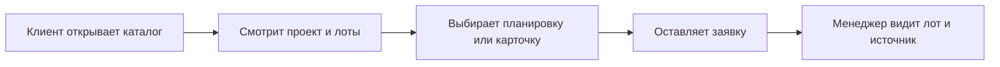

Смарт-каталог GRIDIX - это рабочий инструмент продаж, где собраны проекты, лоты, цены, статусы, планировки, материалы и формы заявки.

Это не только шахматка. Смарт-каталог помогает менеджеру или партнёру застройщика быстро показать клиенту актуальные варианты, проверить доступность и перейти к заявке.

## Для кого нужен

<Tabs>
  <Tab title="Девелопер">
    Девелопер управляет данными: лотами, ценами, статусами, планировками, публичностью и доступом партнёров застройщика.
  </Tab>
  <Tab title="Менеджер продаж">
    Менеджер открывает смарт-каталог на встрече, показывает клиенту доступные лоты и сразу переходит к заявке или отправке ссылки.
  </Tab>
  <Tab title="Партнёр застройщика">
    Партнёр видит только те проекты и лоты, к которым девелопер открыл доступ. Это помогает работать с актуальными ценами и статусами.
  </Tab>
</Tabs>

## Что можно сделать

<CardGroup cols={2}>
  <Card title="Показать доступные лоты" icon="table">
    Быстро открыть актуальные квартиры, апартаменты, коммерческие помещения, виллы или другие объекты.
  </Card>
  <Card title="Проверить цену и статус" icon="tag">
    Убедиться, что лот свободен, забронирован, продан или скрыт из публичного сценария.
  </Card>
  <Card title="Открыть планировку" icon="map">
    Показать план этажа, карточку лота, параметры и материалы.
  </Card>
  <Card title="Перейти к заявке" icon="inbox">
    Зафиксировать интерес клиента и сохранить связь заявки с проектом, лотом и источником.
  </Card>
</CardGroup>

## Как клиент выбирает лот

## Что подготовить заранее

- актуальный список лотов;
- цены и статусы;
- планировки и изображения;
- характеристики лотов;
- правила видимости: что показывать клиенту, менеджеру и партнёру застройщика;
- форму заявки и ответственных за обработку.

## Как проверить смарт-каталог

<Steps>
  <Step title="Откройте проект как пользователь">
    Проверьте каталог не из режима редактирования, а в сценарии просмотра.
  </Step>
  <Step title="Проверьте разные статусы">
    Откройте свободный, забронированный, проданный и скрытый лот, если такие статусы используются.
  </Step>
  <Step title="Проверьте планировки">
    Убедитесь, что изображения читаются на desktop и mobile.
  </Step>
  <Step title="Отправьте тестовую заявку">
    Проверьте, что заявка связана с правильным проектом, лотом и источником.
  </Step>
</Steps>

<Warning>
  Смарт-каталог показывает данные из GRIDIX. Перед отправкой клиенту проверьте цены, статусы и доступность лотов.
</Warning>

<Frame>
  Сюда скриншот: смарт-каталог с фильтрами, карточкой лота и видимым статусом.
</Frame>

<Frame>
  Сюда видео: смарт-каталог в работе менеджера в офисе.
</Frame>

## Что дальше

<CardGroup cols={3}>
  <Card title="Лоты" icon="table" href="/ru/projects/apartments">
    Настройте данные лотов, цены и характеристики.
  </Card>
  <Card title="Публичный каталог" icon="code" href="/ru/widgets/public-catalog">
    Проверьте клиентскую страницу проекта.
  </Card>
  <Card title="Виджет" icon="code" href="/ru/widgets/embedding">
    Встройте каталог на сайт девелопера.
  </Card>
</CardGroup>
